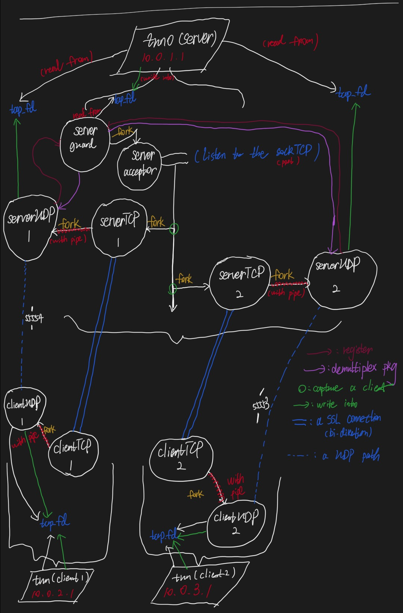

## 1. Answers to Questions
### Question 2.1: Why UDP is better?
1. At least in our exp set-up, all the VMs run in a local network, and thus it's nearly impossible to witness pkg loss and broken. Even when these happen, it's also OK, because... (see the next one!)
2. Since our vpn app runs at `network layer`, it's not its responsibility to ensure the integrity and order of the packages. The program running at the both sides will ensure these property. (For instance, `ssh` use `TCP` to satisfy package integrity and order and so on...)
3. According to the first two reasons, it's better to choose `UDP` for its lower overhead, flexibility and lower latancy (in our senario)

### Question 2.2: Why it is not recommended to implement your own (crypto) algorithm?
- An basic rule: `Stop Trying to Reinvent the Wheel`. Especially in the filed of security, it's important that your function really behaves in a right way, along with great efficiency and no flaws which can be utilized. I can't ensure my implementation within a week can do such a great thing, but the library which experiences the challenge from attackers all over the world over a long time maybe can ensure this in most cases.

### Question 2.3: Why is it important for the server to release resources when a connection is broken?
- It's obvious. If the server does not do so, after serving a certain number of clients, the memory of server will be full and will never be able to accept any new clients. In this situation only restart or cleaning up manually can solve this issue.
- But if the server can release the recources properly whenever a client leaves or the connection is broken, it will have the ability to serve forever (unless some fatal error happens in this system or the number of clients exceeds the limit of the server's capacity).
- In my implementation, this is in `simpletun.c#L389` ( `if (My_SSL_read((char *)key, 32) <= 0){` ). This instr will be executed in serverTCP process (will be explained later) and if the client it down, this blocking function will directly return failure and then release the resources and quit properly. Please see my code for more details.

## 2. Code Logic
- See below for an overview of my implementation: (`Parallelograms` are `devices` and `circles` are `processes`)  

### 2.1 Security details
- [./README.md] discribes some details.
- They are implemented in `my_ssl.c`, `my_aes.c` and `my_mac.c`
- Keys and Certifications are all in the uploaded directory.
#### 2.1.1 Discuss things in Step4: `what attacks your VPN prevents and what you did to prevent them`
1. The payload through two VPN ends is protected by `Encrypt-then-MAC` method. This prevents the `directly attack to the payload`.
2. The key exchange (also later key alter) is through a SSL connection implemented by OpenSSL, so I can also beleive the key exchange process is secure, and all the attacks which want to listen session key (and iv) will fail.
3. The authentication process is secure, too(at least in my implementation). Though verifying the Certification happens before the SSL connection and thus the malicious attacker in the middle can only get the Certification, he/she can do nothing about this since he/she does not have the private keys!

### 2.2 TCP-UDP process pair
- In the client-side and each tunnel in server-side, there'll be a TCP-UDP process pair connected by Unix pipes. The pipes provides a way to communicate important information(UDP port/Client's virtual IP/Key/IV). The ClientTCP-ServerTCP pair will do so using SSL connection (so it's secure), too. __But the ClientUDP process and ServerUDP process will never talk about these directly, they can only be informed through ClientTCP/ServerTCP process__
- See the figure above for an intuition.

### 2.3 Server-side `demultiplexing`
- In server-side I use different processes to serve client requests from different IPs. This raises an issue: 
    - __These (ServerUDP) processes will cause read contension if they all want to read from the tap/tun device.__
    - This will certainly happen if we just fork() and retain the logic of original code `simpletun.c`
- The solution by me is: create a brand new process (let's call it GUARD), which is responsible to read from tap/tun and distribute the msg from it to the `proper` (ServerUPD) process. My implementation uses `POSIX message queue` and add a registration procedure to let GUARD know all the potential msg recievers.
- Note that msg from the network can be sent to the tap/tun directly from ServerUPD processes, cause there's only one process in tun/tap which will read all the data.
- See the figure above for an intuition.
- See the code for more details (especially commit `44109e9b0812540ed3e34f8409f4efb501f210ab` shows my solution clearly)

## -1. Appendix
### 1. exit number
- `1`: Normal error, will be described by `perror`
<!-- - `4`: Data's integrity is broken -->
- `5`: HMAC-SHA256 returns wrong hash length
- `6`: build SSL connection error
- `7`: Can't find intity's crt file
- `8`: Can't fine intity's key file
- `11`: Server Guard: registrition error
- `12`: Server Guard: registrition length error